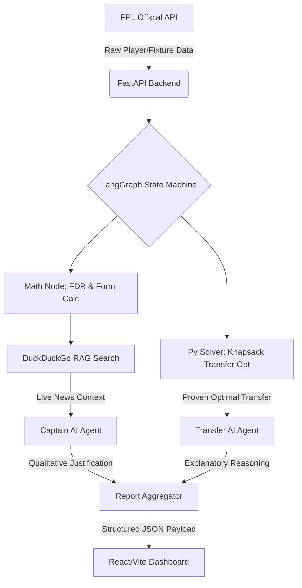

<div align="center">
  <h1>⚽ FPL AI Copilot</h1>
  <p><strong>An intelligent, multi-agent AI system analyzing Fantasy Premier League data to provide mathematically optimized transfer and captaincy recommendations.</strong></p>

  <!-- Badges -->
  <a href="https://reactjs.org/"></a>
  <a href="https://fastapi.tiangolo.com/"></a>
  <a href="https://python.org"></a>
  <a href="https://langchain.com/"></a>
</div>

<br />

## 📖 Overview

**FPL AI Copilot** represents a modern approach to AI engineering: decoupling strict mathematical constraints from qualitative LLM reasoning. Because LLMs notoriously struggle with the *Knapsack Optimization Problem* (e.g., maximizing squad Expected Points within a strict £100m budget), this pipeline delegates deterministic math to Python solvers and utilizes Generative AI strictly as an **Explanatory Layer** and **Contextual RAG Evaluator**.

The result is a blazingly fast, hallucination-free dashboard that serves premium football analytics and actionable intelligence to Fantasy Premier League managers.

---

## ✨ Key Features

*   🧠 **Hybrid Optimization Pipeline:** Custom Python knapsack solvers compute Expected Points (xP) maximizing transfers across 600+ players, eliminating LLM arithmetic hallucinations.
*   📰 **Multi-Modal RAG (DuckDuckGo):** Real-time unstructured web scraping injects live news and press conference transcripts into the prompt envelope, overriding mathematical selections if a player is an injury risk.
*   🤖 **LangGraph Orchestration:** Determines execution graph based on live API health, routing payloads between deterministic statistical nodes and the Kimi/Groq evaluation model.
*   📊 **Premium Analytical UI:** A responsive React/Vite frontend featuring dynamic pitch formation rendering, opponent FDR (Fixture Difficulty Rating) color mapping, and interactive player comparison radar charts.
*   🛡️ **Enterprise Observability:** Fully instrumented with `LangSmith` for token-cost evaluation, graph tracing, and prompt-latency logging.

---

## 🏗️ Architecture



---

## 💻 Tech Stack

### AI & Backend
*   **LangGraph / LangChain:** Core agent orchestration and state management
*   **Groq (Kimi Model):** Ultra-low latency LLM inference
*   **DuckDuckGo Search:** Live retrieval for RAG context
*   **PuLP:** Linear optimization for budget/transfer constraints
*   **FastAPI / Uvicorn:** REST API layer handling async requests
*   **LangSmith:** Prompt tracing and telemetry

### Frontend
*   **React (Vite):** Lightning-fast HMR and build pipeline
*   **Recharts:** Interactive radar and temporal point-history plotting
*   **Vanilla CSS:** Custom-engineered glassmorphic dark-mode design system

---

## 🚀 Quick Start (Local Development)

### Prerequisites
*   Python 3.10+
*   Node.js 18+
*   A [Groq API Key](https://console.groq.com/)

### 1. Backend Setup

```bash
# Clone the repository
git clone https://github.com/HariHaran9597/fpl-ai-copilot.git
cd fpl-ai-copilot

# Set up the Python virtual environment
python -m venv venv
source venv/bin/activate  # Windows: .\venv\Scripts\activate

# Install dependencies
pip install -r requirements.txt

# Configure environment variables
echo "GROQ_API_KEY=your_api_key_here" > .env
# Optional: Enable LangSmith Tracing
echo "LANGCHAIN_TRACING_V2=true" >> .env

# Start the FastAPI server
uvicorn app.main:app --host 127.0.0.1 --port 8000 --reload
```

### 2. Frontend Setup

```bash
# Open a new terminal and navigate to the frontend directory
cd frontend

# Install Node modules
npm install

# Start the Vite development server
npm run dev
```

Navigate to `http://localhost:5173`, input your FPL Manager ID, and watch the pipeline run!

---

## 🔮 Future Roadmap (v2)

While the current version provides excellent qualitative reasoning and a premium interface, the roadmap for the next iteration focuses on predictive modeling limits:

1. **XGBoost Expected Points (xP) Integration:** Replacing the current heuristic form/FDR formulas with a trained LightGBM/XGBoost regressor to predict 5-Gameweek rolling Expected Points.
2. **Dedicated Vector DB:** Moving from live DuckDuckGo API searches to a cron-job fed Pinecone/FAISS database continually scraping `r/FantasyPL` for instantaneous context retrieval.
3. **Structured Sub-Agents:** Reintroducing strict JSON-schema tool calling (`bind_tools`) specifically for constraint-checking agents validating squad injury probabilities.

---

<div align="center">
  <p>Engineered for the 2024/25 Premier League Season.</p>
</div>
