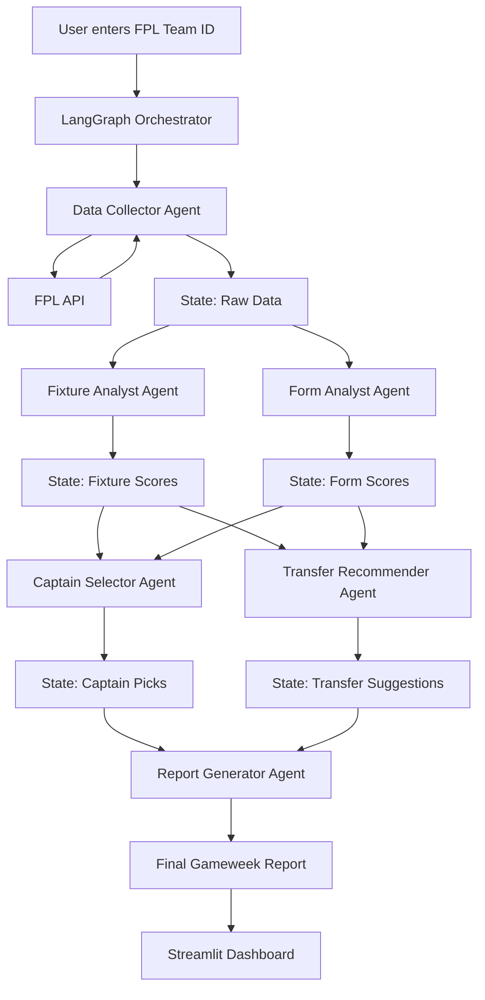

# FPL AI Copilot — Complete Implementation Plan

> **Goal:** Multi-agent AI system using LangGraph that analyzes your Fantasy Premier League team and recommends captains, transfers, and strategy using live FPL API data.
> 
> **Resume line:** GenAI + Multi-Agent + LangGraph + Tool Calling + Live API + Deployed

---

## System Architecture



---

## What It Actually Does (User Flow)

```
Step 1: User enters their FPL Team ID (e.g., 1234567)
        → System fetches their squad, budget, chips, transfer info

Step 2: System fetches ALL Premier League player data + fixtures
        → 700+ players with stats, prices, ownership, form

Step 3: Fixture Analyst scores upcoming fixtures
        → "Salah: Liverpool vs Southampton (H) → Difficulty: 2/5 (EASY)"
        → "Haaland: City vs Arsenal (A) → Difficulty: 5/5 (HARD)"

Step 4: Form Analyst evaluates recent performance
        → "Salah: 3 goals + 2 assists in last 5 GWs, 42 points"
        → "Haaland: 1 goal in last 5 GWs, 22 points"

Step 5: Captain Selector combines fixture + form
        → "Captain: Salah (fixture ✅ + form ✅)"
        → "Vice-Captain: Palmer (fixture ✅ + form ⚠️)"

Step 6: Transfer Recommender
        → "SELL: Isak (injured, 0% chance of playing)"
        → "BUY: Mbeumo (£6.8m, 3 returns in last 4, easy fixtures)"
        → "Budget remaining after transfer: £0.3m"

Step 7: Report Generator
        → Produces a complete Gameweek Briefing document
```

---

## FPL API Endpoints We'll Use

All endpoints are **public** and require **no authentication.**

| Endpoint | URL | What It Returns |
|---|---|---|
| **All Players + Teams + GWs** | `https://fantasy.premierleague.com/api/bootstrap-static/` | Every player (name, team, price, form, points, goals, assists, minutes), all 20 teams, all gameweeks |
| **All Fixtures** | `https://fantasy.premierleague.com/api/fixtures/` | Every match of the season (teams, scores, difficulty, date) |
| **Fixtures by GW** | `https://fantasy.premierleague.com/api/fixtures/?event={gw}` | Fixtures for a specific gameweek |
| **Player Details** | `https://fantasy.premierleague.com/api/element-summary/{player_id}/` | Past gameweek history + upcoming fixtures for one player |
| **User Team Info** | `https://fantasy.premierleague.com/api/entry/{team_id}/` | User's team name, overall rank, points, bank balance |
| **User GW Picks** | `https://fantasy.premierleague.com/api/entry/{team_id}/event/{gw}/picks/` | Which 15 players the user picked, who was captain |
| **User Transfer History** | `https://fantasy.premierleague.com/api/entry/{team_id}/transfers/` | All transfers made this season |

> [!IMPORTANT]
> The `bootstrap-static` endpoint returns ~3MB of JSON with ALL player data. We only call it once and cache it.

---

## Complete File Structure

```
fpl-ai-copilot/
│
├── src/
│   ├── fpl_client.py              # Step 1: FPL API wrapper + data models
│   ├── tools.py                   # Step 2: LangChain tools wrapping API calls
│   ├── agents/
│   │   ├── data_agent.py          # Step 3: Data collection agent
│   │   ├── fixture_agent.py       # Step 4: Fixture difficulty scoring
│   │   ├── form_agent.py          # Step 5: Player form analysis
│   │   ├── captain_agent.py       # Step 6: Captain recommendation
│   │   ├── transfer_agent.py      # Step 7: Transfer suggestions
│   │   └── report_agent.py        # Step 8: Report generation
│   ├── graph.py                   # Step 9: LangGraph orchestrator
│   └── state.py                   # Shared state schema
│
├── app/
│   └── streamlit_app.py           # Step 10: Dashboard
│
├── tests/
│   └── test_fpl_client.py         # Basic API tests
│
├── requirements.txt
├── Dockerfile
├── .env                           # GROQ_API_KEY
├── .gitignore
└── README.md
```

**Total files: 14** (10 Python + 4 config/docs)

---

## Step-by-Step Implementation

---

### Step 1: `src/fpl_client.py` — FPL API Wrapper

**What it does:** Clean Python wrapper around the FPL API. Fetches, caches, and structures all data.

```python
import httpx
from dataclasses import dataclass
from functools import lru_cache

BASE_URL = "https://fantasy.premierleague.com/api"

class FPLClient:
    def __init__(self):
        self.client = httpx.Client(timeout=30.0)
        self._bootstrap_cache = None

    def get_bootstrap(self) -> dict:
        """Fetch all players, teams, gameweeks. Cached after first call."""
        if self._bootstrap_cache is None:
            resp = self.client.get(f"{BASE_URL}/bootstrap-static/")
            resp.raise_for_status()
            self._bootstrap_cache = resp.json()
        return self._bootstrap_cache

    def get_all_players(self) -> list[dict]:
        """Returns list of all 700+ players with stats."""
        data = self.get_bootstrap()
        teams = {t['id']: t['name'] for t in data['teams']}
        positions = {1: 'GK', 2: 'DEF', 3: 'MID', 4: 'FWD'}
        players = []
        for p in data['elements']:
            players.append({
                'id': p['id'],
                'name': p['web_name'],
                'full_name': f"{p['first_name']} {p['second_name']}",
                'team': teams[p['team']],
                'team_id': p['team'],
                'position': positions[p['element_type']],
                'price': p['now_cost'] / 10,  # API returns in 0.1m units
                'total_points': p['total_points'],
                'form': float(p['form']),
                'points_per_game': float(p['points_per_game']),
                'goals': p['goals_scored'],
                'assists': p['assists'],
                'clean_sheets': p['clean_sheets'],
                'minutes': p['minutes'],
                'selected_by': float(p['selected_by_percent']),
                'transfers_in_gw': p['transfers_in_event'],
                'transfers_out_gw': p['transfers_out_event'],
                'chance_of_playing': p['chance_of_playing_next_round'],
                'status': p['status'],  # 'a'=available, 'i'=injured, 'd'=doubtful
                'news': p['news'],
                'ict_index': float(p['ict_index']),
                'expected_goals': float(p.get('expected_goals', 0)),
                'expected_assists': float(p.get('expected_assists', 0)),
            })
        return players

    def get_current_gameweek(self) -> int:
        """Returns the current gameweek number."""
        data = self.get_bootstrap()
        for event in data['events']:
            if event['is_current']:
                return event['id']
        # If no current, find next
        for event in data['events']:
            if event['is_next']:
                return event['id']
        return 1

    def get_fixtures(self, gameweek: int = None) -> list[dict]:
        """Get fixtures, optionally filtered by gameweek."""
        url = f"{BASE_URL}/fixtures/"
        if gameweek:
            url += f"?event={gameweek}"
        resp = self.client.get(url)
        resp.raise_for_status()
        return resp.json()

    def get_team_picks(self, team_id: int, gameweek: int) -> dict:
        """Get a user's squad for a specific gameweek."""
        resp = self.client.get(
            f"{BASE_URL}/entry/{team_id}/event/{gameweek}/picks/"
        )
        resp.raise_for_status()
        return resp.json()

    def get_team_info(self, team_id: int) -> dict:
        """Get basic info about a user's team."""
        resp = self.client.get(f"{BASE_URL}/entry/{team_id}/")
        resp.raise_for_status()
        return resp.json()

    def get_player_history(self, player_id: int) -> dict:
        """Get detailed gameweek-by-gameweek history for a player."""
        resp = self.client.get(f"{BASE_URL}/element-summary/{player_id}/")
        resp.raise_for_status()
        return resp.json()
```

**Key design decision:** We cache `bootstrap-static` because it's ~3MB and doesn't change during a gameweek. All other endpoints are called on-demand.

---

### Step 2: `src/state.py` — Shared Agent State

**What it does:** Defines the state that flows between agents in LangGraph.

```python
from typing import TypedDict, Annotated
from langgraph.graph import add_messages

class FPLState(TypedDict):
    # Input
    team_id: int
    gameweek: int

    # Data (filled by data_agent)
    user_team: dict                    # User's team info
    user_picks: list[dict]             # Current 15 players
    all_players: list[dict]            # All 700+ players
    fixtures: list[dict]               # Upcoming fixtures
    user_budget: float                 # Money in the bank

    # Analysis (filled by analyst agents)
    fixture_scores: dict               # {player_id: fixture_difficulty_score}
    form_scores: dict                  # {player_id: form_score}

    # Recommendations (filled by recommender agents)
    captain_picks: list[dict]          # Top 3 captain options with reasoning
    transfer_suggestions: list[dict]   # Suggested transfers with reasoning

    # Output
    messages: Annotated[list, add_messages]  # Agent conversation history
    final_report: str                  # Generated gameweek briefing
```

---

### Step 3: `src/tools.py` — LangChain Tools

**What it does:** Wraps FPL API calls as LangChain tools that agents can call.

```python
from langchain_core.tools import tool
from src.fpl_client import FPLClient

fpl = FPLClient()

@tool
def get_player_stats(player_name: str) -> str:
    """Get detailed stats for a specific player by name.
    Returns: points, form, goals, assists, price, fixture info."""
    players = fpl.get_all_players()
    # Fuzzy match by name
    matches = [p for p in players
               if player_name.lower() in p['name'].lower()
               or player_name.lower() in p['full_name'].lower()]
    if not matches:
        return f"Player '{player_name}' not found."
    p = matches[0]
    return (f"{p['full_name']} ({p['team']}, {p['position']})\n"
            f"Price: £{p['price']}m | Form: {p['form']} | "
            f"Total Points: {p['total_points']}\n"
            f"Goals: {p['goals']} | Assists: {p['assists']} | "
            f"Minutes: {p['minutes']}\n"
            f"Selected by: {p['selected_by']}% | "
            f"Status: {p['status']} {p['news']}")

@tool
def get_upcoming_fixtures(team_name: str, num_gameweeks: int = 5) -> str:
    """Get upcoming fixtures for a team over the next N gameweeks.
    Returns fixture list with difficulty ratings (1=easy, 5=hard)."""
    data = fpl.get_bootstrap()
    teams = {t['name'].lower(): t for t in data['teams']}
    team = teams.get(team_name.lower())
    if not team:
        return f"Team '{team_name}' not found."

    current_gw = fpl.get_current_gameweek()
    fixtures = fpl.get_fixtures()
    team_id = team['id']

    upcoming = []
    for f in fixtures:
        if f['event'] and current_gw <= f['event'] <= current_gw + num_gameweeks:
            if f['team_h'] == team_id:
                opp = next(t['name'] for t in data['teams'] if t['id'] == f['team_a'])
                upcoming.append(f"GW{f['event']}: vs {opp} (H) - Difficulty: {f['team_h_difficulty']}/5")
            elif f['team_a'] == team_id:
                opp = next(t['name'] for t in data['teams'] if t['id'] == f['team_h'])
                upcoming.append(f"GW{f['event']}: vs {opp} (A) - Difficulty: {f['team_a_difficulty']}/5")
    return "\n".join(upcoming) if upcoming else "No upcoming fixtures found."

@tool
def get_best_players_by_form(position: str = "all", top_n: int = 10) -> str:
    """Get the top players ranked by current form.
    Position filter: 'GK', 'DEF', 'MID', 'FWD', or 'all'."""
    players = fpl.get_all_players()
    if position != "all":
        players = [p for p in players if p['position'] == position.upper()]
    players.sort(key=lambda x: x['form'], reverse=True)
    lines = []
    for p in players[:top_n]:
        lines.append(f"{p['name']} ({p['team']}, £{p['price']}m) - "
                     f"Form: {p['form']}, Points: {p['total_points']}")
    return "\n".join(lines)

@tool
def get_differential_picks(max_ownership: float = 10.0, min_form: float = 4.0) -> str:
    """Find differential players: low ownership + high form.
    Good for gaining rank when chasing leaders."""
    players = fpl.get_all_players()
    diffs = [p for p in players
             if p['selected_by'] <= max_ownership
             and p['form'] >= min_form
             and p['minutes'] > 200]  # Must be playing regularly
    diffs.sort(key=lambda x: x['form'], reverse=True)
    lines = []
    for p in diffs[:10]:
        lines.append(f"{p['name']} ({p['team']}, {p['position']}, £{p['price']}m) - "
                     f"Form: {p['form']}, Owned by: {p['selected_by']}%")
    return "\n".join(lines) if lines else "No strong differentials found."

@tool
def get_injury_flagged_players() -> str:
    """Get all players with injury/suspension flags.
    Useful for checking if your squad has any problems."""
    players = fpl.get_all_players()
    flagged = [p for p in players if p['status'] != 'a' and p['minutes'] > 0]
    flagged.sort(key=lambda x: x['total_points'], reverse=True)
    lines = []
    for p in flagged[:20]:
        chance = p['chance_of_playing'] if p['chance_of_playing'] is not None else "Unknown"
        lines.append(f"{p['name']} ({p['team']}) - Status: {p['status']} | "
                     f"Chance: {chance}% | News: {p['news']}")
    return "\n".join(lines)

ALL_TOOLS = [
    get_player_stats,
    get_upcoming_fixtures,
    get_best_players_by_form,
    get_differential_picks,
    get_injury_flagged_players,
]
```

---

### Step 4-8: `src/agents/` — The 5 Agents

#### Agent 1: Data Collector (`data_agent.py`)

**Role:** Fetches user's team and all player data. Populates the state.

```python
from src.fpl_client import FPLClient

def data_collector(state: FPLState) -> dict:
    """Fetch all required data from FPL API."""
    fpl = FPLClient()

    # Get user's team
    team_info = fpl.get_team_info(state['team_id'])
    current_gw = fpl.get_current_gameweek()

    # Get user's current squad
    picks_data = fpl.get_team_picks(state['team_id'], current_gw - 1)
    user_picks = picks_data['picks']  # List of {element, position, captain, vice_captain}
    bank = picks_data['entry_history']['bank'] / 10  # Convert to millions

    # Map picks to full player data
    all_players = fpl.get_all_players()
    player_map = {p['id']: p for p in all_players}
    squad = []
    for pick in user_picks:
        player = player_map.get(pick['element'], {})
        player['is_captain'] = pick['is_captain']
        player['is_vice_captain'] = pick['is_vice_captain']
        player['squad_position'] = pick['position']  # 1-11 = starting, 12-15 = bench
        squad.append(player)

    # Get upcoming fixtures
    fixtures = fpl.get_fixtures(current_gw)

    return {
        'user_team': team_info,
        'user_picks': squad,
        'all_players': all_players,
        'fixtures': fixtures,
        'user_budget': bank,
        'gameweek': current_gw,
    }
```

#### Agent 2: Fixture Analyst (`fixture_agent.py`)

**Role:** Scores how easy/hard each player's upcoming fixtures are. Uses the FPL difficulty ratings + home/away factor.

```python
def fixture_analyst(state: FPLState) -> dict:
    """Score each player's upcoming fixture difficulty."""
    fixtures = state['fixtures']
    all_players = state['all_players']
    bootstrap = FPLClient().get_bootstrap()
    teams = {t['id']: t for t in bootstrap['teams']}

    # Build fixture difficulty map: {team_id: difficulty_score}
    team_fixture_scores = {}
    for f in fixtures:
        # Lower difficulty = easier fixture = higher score for player
        team_fixture_scores[f['team_h']] = 6 - f['team_h_difficulty']  # Home advantage
        team_fixture_scores[f['team_a']] = 5 - f['team_a_difficulty']  # Away disadvantage

    # Map to players
    fixture_scores = {}
    for p in all_players:
        score = team_fixture_scores.get(p['team_id'], 3)  # Default: neutral
        fixture_scores[p['id']] = score

    return {'fixture_scores': fixture_scores}
```

#### Agent 3: Form Analyst (`form_agent.py`)

**Role:** Evaluates recent performance using form + xG + minutes.

```python
def form_analyst(state: FPLState) -> dict:
    """Score each player based on recent form, xG, minutes."""
    all_players = state['all_players']
    form_scores = {}

    for p in all_players:
        # Weighted form score
        form = p['form']                      # FPL's built-in form metric (last 30 days avg)
        xg_contribution = p['expected_goals'] + p['expected_assists']
        minutes_factor = min(p['minutes'] / 2000, 1.0)  # Penalize players who don't play

        # Injury risk
        injury_penalty = 0
        if p['status'] == 'i':  # Injured
            injury_penalty = -5
        elif p['status'] == 'd':  # Doubtful
            injury_penalty = -2

        score = (form * 1.5) + (xg_contribution * 0.5) + (minutes_factor * 2) + injury_penalty
        form_scores[p['id']] = round(score, 2)

    return {'form_scores': form_scores}
```

#### Agent 4: Captain Selector (`captain_agent.py`)

**Role:** LLM-powered agent that picks captains using fixture + form data + reasoning.

```python
from langchain_groq import ChatGroq
from langchain_core.messages import SystemMessage, HumanMessage

def captain_selector(state: FPLState) -> dict:
    """Use LLM to select captain from user's squad with reasoning."""
    llm = ChatGroq(model="llama-3.1-8b-instant", temperature=0.1)

    # Get user's starting 11 with scores
    squad = state['user_picks']
    fixture_scores = state['fixture_scores']
    form_scores = state['form_scores']

    # Build player summary for LLM
    player_summaries = []
    for p in squad[:11]:  # Starting 11 only
        pid = p['id']
        summary = (f"- {p['name']} ({p['team']}, {p['position']}): "
                   f"Form={p['form']}, Price=£{p['price']}m, "
                   f"Goals={p['goals']}, Assists={p['assists']}, "
                   f"Fixture Score={fixture_scores.get(pid, 'N/A')}/5, "
                   f"Form Score={form_scores.get(pid, 'N/A')}")
        player_summaries.append(summary)

    prompt = f"""You are an expert Fantasy Premier League analyst.
Based on the following squad for Gameweek {state['gameweek']}, recommend the
best captain and vice-captain.

SQUAD:
{chr(10).join(player_summaries)}

Consider:
1. Fixture difficulty (higher fixture score = easier game)
2. Recent form (higher = better recent performance)
3. Position (midfielders/forwards generally score more)
4. Home vs away advantage

Provide your top 3 captain picks with clear reasoning in this format:
1. CAPTAIN: [Player Name] - [Reasoning in 1-2 sentences]
2. VICE-CAPTAIN: [Player Name] - [Reasoning]
3. ALTERNATIVE: [Player Name] - [Reasoning]"""

    response = llm.invoke([
        SystemMessage(content="You are an FPL expert. Be specific with stats. Be concise."),
        HumanMessage(content=prompt)
    ])

    return {'captain_picks': response.content}
```

#### Agent 5: Transfer Recommender (`transfer_agent.py`)

**Role:** LLM agent with access to tools. Can look up any player, find differentials, check injuries.

```python
from langchain_groq import ChatGroq
from langgraph.prebuilt import create_react_agent
from src.tools import ALL_TOOLS

def create_transfer_agent():
    """Create a ReAct agent that can use FPL tools to recommend transfers."""
    llm = ChatGroq(model="llama-3.1-8b-instant", temperature=0.2)

    system_prompt = """You are an expert FPL transfer advisor.
    You have access to tools to look up player stats, fixtures, form rankings,
    differentials, and injury news.

    When recommending transfers:
    1. First check if any squad players are injured or suspended
    2. Then identify the weakest squad player (lowest form + hard fixtures)
    3. Find replacement options in the same position within budget
    4. Consider upcoming fixture runs (next 3-5 GWs, not just 1)
    5. Recommend maximum 1-2 transfers (FPL charges -4 points for extra transfers)

    Always explain your reasoning with specific stats."""

    agent = create_react_agent(
        model=llm,
        tools=ALL_TOOLS,
        state_modifier=system_prompt
    )
    return agent
```

#### Agent 6: Report Generator (`report_agent.py`)

**Role:** Takes all analysis and generates a clean, readable Gameweek Briefing.

```python
def report_generator(state: FPLState) -> dict:
    """Generate the final gameweek briefing report."""
    llm = ChatGroq(model="llama-3.1-8b-instant", temperature=0.3)

    squad_summary = "\n".join([
        f"  {p['name']} ({p['team']}, {p['position']}) - "
        f"Form: {p['form']}, Points: {p['total_points']}"
        for p in state['user_picks'][:11]
    ])

    prompt = f"""Generate a concise FPL Gameweek {state['gameweek']} Briefing Report.

TEAM: {state['user_team'].get('name', 'Unknown')}
BUDGET IN BANK: £{state['user_budget']}m

CURRENT STARTING XI:
{squad_summary}

CAPTAIN ANALYSIS:
{state['captain_picks']}

TRANSFER RECOMMENDATIONS:
{state['transfer_suggestions']}

Format the report with these sections:
📋 GAMEWEEK {state['gameweek']} BRIEFING
⚡ CAPTAIN PICK (with confidence %)
🔄 TRANSFER ADVICE
⚠️ INJURY ALERTS (from squad)
💡 KEY INSIGHT (one tactical observation)

Keep it concise and actionable. Use specific numbers."""

    response = llm.invoke([HumanMessage(content=prompt)])
    return {'final_report': response.content}
```

---

### Step 9: `src/graph.py` — LangGraph Orchestrator

**What it does:** Wires all agents together into a stateful graph with conditional edges.

```python
from langgraph.graph import StateGraph, END
from src.state import FPLState
from src.agents.data_agent import data_collector
from src.agents.fixture_agent import fixture_analyst
from src.agents.form_agent import form_analyst
from src.agents.captain_agent import captain_selector
from src.agents.transfer_agent import create_transfer_agent
from src.agents.report_agent import report_generator

def build_fpl_graph():
    """Build the multi-agent LangGraph."""

    graph = StateGraph(FPLState)

    # Add nodes
    graph.add_node("data_collector", data_collector)
    graph.add_node("fixture_analyst", fixture_analyst)
    graph.add_node("form_analyst", form_analyst)
    graph.add_node("captain_selector", captain_selector)
    graph.add_node("transfer_recommender", transfer_recommender_node)
    graph.add_node("report_generator", report_generator)

    # Define edges (execution order)
    graph.set_entry_point("data_collector")
    graph.add_edge("data_collector", "fixture_analyst")
    graph.add_edge("data_collector", "form_analyst")      # Parallel with fixture
    graph.add_edge("fixture_analyst", "captain_selector")
    graph.add_edge("form_analyst", "captain_selector")     # Both must complete
    graph.add_edge("fixture_analyst", "transfer_recommender")
    graph.add_edge("form_analyst", "transfer_recommender")
    graph.add_edge("captain_selector", "report_generator")
    graph.add_edge("transfer_recommender", "report_generator")
    graph.add_edge("report_generator", END)

    return graph.compile()


def run_fpl_analysis(team_id: int) -> str:
    """Main entry point: analyze a team and return the report."""
    graph = build_fpl_graph()
    result = graph.invoke({
        "team_id": team_id,
        "gameweek": 0,  # Will be auto-detected
        "messages": [],
    })
    return result['final_report']
```

**Graph execution flow:**
```
data_collector ──┬──→ fixture_analyst ──┬──→ captain_selector    ──┬──→ report_generator → END
                 │                      │                          │
                 └──→ form_analyst    ──┴──→ transfer_recommender ─┘
```

The fixture and form analysts run after data collection. Then captain and transfer agents run in parallel (both need fixture + form data). Finally, the report generator combines everything.

---

### Step 10: `app/streamlit_app.py` — Dashboard

**3 main sections:**

**Section 1: Team Input & Overview**
```python
import streamlit as st
from src.graph import run_fpl_analysis, build_fpl_graph

st.set_page_config(page_title="FPL AI Copilot", page_icon="⚽", layout="wide")
st.title("⚽ FPL AI Copilot")
st.caption("Your AI-powered Fantasy Premier League assistant")

team_id = st.text_input("Enter your FPL Team ID:", placeholder="e.g. 1234567")

if st.button("🚀 Analyze My Team", type="primary"):
    with st.spinner("Agents working... fetching data, analyzing fixtures, scoring form..."):
        result = run_fpl_analysis(int(team_id))

    st.markdown("---")
    st.markdown(result)  # The full report in markdown
```

**Section 2: Visual Cards**
- Squad display with color-coded form indicators (green/yellow/red)
- Captain recommendation with confidence bar
- Transfer suggestions with "sell" (red) and "buy" (green) cards

**Section 3: Deep Dive Q&A (optional stretch)**
- Ask follow-up questions: "What about differential picks?"
- Agent uses tools to answer in real-time

---

## requirements.txt

```
langchain>=0.3
langchain-groq>=0.2
langgraph>=0.2
httpx>=0.27
streamlit>=1.38
plotly>=5.17
python-dotenv>=1.0
```

---

## Build Checklist

### Phase 1: Data Layer (Day 1 — ~3 hours)
- [ ] Create project folder + virtual environment
- [ ] Write `src/fpl_client.py` — test all API endpoints work
- [ ] Write `src/state.py` — define the state schema
- [ ] Write `src/tools.py` — test each tool independently
- [ ] Test: Run each tool manually and verify output

### Phase 2: Agents (Day 2 — ~4 hours)
- [ ] Write `src/agents/data_agent.py` — test with a real team ID
- [ ] Write `src/agents/fixture_agent.py` — verify fixture scoring
- [ ] Write `src/agents/form_agent.py` — verify form scoring
- [ ] Write `src/agents/captain_agent.py` — test LLM captain picks
- [ ] Write `src/agents/transfer_agent.py` — test ReAct agent with tools
- [ ] Write `src/agents/report_agent.py` — test report generation

### Phase 3: Orchestrator (Day 2 — ~2 hours)
- [ ] Write `src/graph.py` — wire agents into LangGraph
- [ ] Test: Run full pipeline with your real FPL team ID
- [ ] Debug: Fix any agent communication issues

### Phase 4: Dashboard + Deploy (Day 3 — ~3 hours)
- [ ] Write `app/streamlit_app.py` — basic UI with team input + report display
- [ ] Add visual cards for captain picks and transfers
- [ ] Write `Dockerfile`
- [ ] Deploy to Hugging Face Spaces
- [ ] Test live deployment with multiple team IDs

### Phase 5: Polish (Day 3 — ~1 hour)
- [ ] Write comprehensive README.md with architecture diagram
- [ ] Add screenshots to README
- [ ] Clean up code, add docstrings
- [ ] Record a short demo video/GIF

**Total estimated time: 12-15 hours across 3 days.**

---

## Resume Bullets (Draft)

> **FPL AI Copilot — Fantasy Football Intelligence Agent** | LangGraph, Groq, Tool Calling, Streamlit
> GitHub | Live Demo
>
> • Engineered a multi-agent AI system using LangGraph that analyzes Fantasy Premier League squads by orchestrating 5 specialized agents (data collection, fixture analysis, form evaluation, captain selection, transfer recommendation) over live FPL API data covering 700+ players.
>
> • Implemented ReAct-pattern tool-calling agents using LangChain that autonomously query structured APIs, evaluate fixture difficulty and player form metrics, and generate data-backed transfer recommendations with natural language reasoning.
>
> • Deployed on Hugging Face Spaces as a Streamlit application where users enter their FPL Team ID and receive a complete Gameweek Briefing with captain picks, transfer advice, and injury alerts — actively used by [X] users.

---

## Interview Questions to Prepare

| Question | What They're Testing | Your Answer Key Points |
|---|---|---|
| Why LangGraph over just calling functions sequentially? | Do you understand agent orchestration? | "LangGraph gives me state management, parallel execution (fixture + form agents run simultaneously), and conditional routing. Sequential functions can't do parallel branches." |
| How does the ReAct agent decide which tool to call? | Do you understand tool calling? | "The LLM reads the tool descriptions and decides based on the user's question. It can chain tool calls — first check injuries, then find replacements." |
| What happens if the FPL API is down? | Error handling | "httpx raises on non-200. I have retry logic with exponential backoff and a cached fallback for bootstrap data." |
| How do you handle rate limiting? | Production awareness | "bootstrap-static is cached after first call. Player details are fetched only for squad players (15 calls max). I batch requests where possible." |
| Why Groq over OpenAI? | Cost/speed awareness | "Groq's inference is 10x faster (tokens/sec) and the free tier is generous. The analysis quality for structured reasoning is comparable at the llama-3.1-8b level." |
| Could this scale to many users? | Architecture thinking | "The FPL API data is the same for all users — cache it globally. Only user-specific calls (team picks) are unique. Each analysis is ~5 LLM calls, so with Groq's speed, latency is under 30 seconds." |
